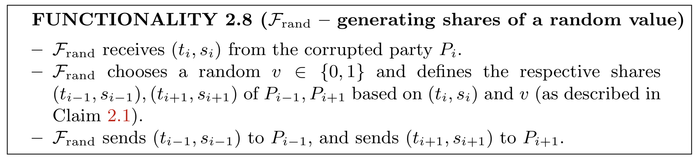

安全三方计算

另一方面，对于随机值的共享生成函数也是具有计算安全性的。各方能生成随机秘密值$v$的共享，但其它方不能知晓。定义功能函数$$\mathcal{F}_{\text{rand}}$$随机选择$$ v \in \{0,1 \}$$，计算出共享$[v]$，并发送给其他发放共享。函数$$\mathcal{F}_{\text{rand}}$$允许腐败方决定他持有的共享，且用这个共享值计算诚实方的秘密共享，以及随机数$v$。函数$$\mathcal{F}_{\text{rand}}$$的构造如下：

在$$ \mathcal{F^2_\text{cr}}$$混合函数$$\mathcal{F}_{\text{rand}}$$的构造如下，不存在任何交互：

显然，协议中$t_1 \oplus t_2 \oplus t_3 = 0$，此外，再定义$v = s_1 \oplus t_3 = r_1 \oplus r_2 \oplus r_3$，这里有 $ s_2 \oplus t_1 $和$ s_3 \oplus t_2 $的值都等于$v$。定义$$ \mathcal{F^2_\text{cr}} $$，腐败方并不清楚均匀随机选择$ r_{i+1} = \alpha_{i+1}$，认为这些值具有随机性。这一步说明，如果协议2.9能安全计算功能函数$$\mathcal{F}_{\text{rand}}$$且在$$ \mathcal{F^2_\text{cr}}$$混合模型下中止协议，那么协议中一定存在一方腐败。用反证法可以证明。

在恶意模型下，还需一个高效的三方抛硬币协议。定义功能函数$$ \mathcal{F_\text{coin}} $$随机选择$s$个随机比特$v_1, \cdots, v_s \in \{0, 1 \}$，并把它发送给每一方。让各方调用$s$次$$ \mathcal{F_\text{rand}} $$函数，然后公开结果。这里会存在一个问题，由于腐败方可能会公开错误的讯息，导致诚实方收到的结果不一致。故需要设计一个子程序$$ \mathsf{compareview}() $$让$P_j$ 发送他的输出给$P_{j+1}$。若任意一方收到的结果不一致，协议终止。假设$P_i$是腐败方，那么$p_{i+2}$一定会收到正确的结果$v_1, \cdots, v_s$，因为他收到的公开值是由诚实方$p_{i+1}$发送的，不会收到腐败方的影响。

